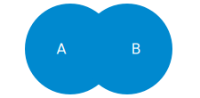

```{r setup, include=FALSE}
options(htmltools.dir.version = FALSE)
knitr::opts_chunk$set(fig.retina = 3)
```

```{r xaringan-themer, include=FALSE, warning=TRUE}
library(xaringanthemer)
style_mono_accent(
  base_color = "#0089CF",
  base_font_size = "24px",
  header_h1_font_size = "2.5rem",
  header_h2_font_size = "2rem",
  header_h3_font_size = "1.5rem",
  title_slide_background_image = "img/lost-at-sea.png",
  title_slide_background_size = "cover",
  title_slide_background_position = "right",
  text_bold_color = "var(--text-color)",
  extra_css = list(
    ".title-slide h1, h2, h3" = list(
      "text-align" = "left",
      "vertical-align" = "top",
      "text-transform" = "capitalize"
    ),
    ".title-slide h1" = list(
      "margin-top" = "-110px"
    ),
    ".remark-slide-number" = list(
      "display" = "none"
    ),
    ".card" = list(
      "position" = "relative",
      "left" = "20%",
      "box-shadow" = "0 4px 8px 1px rgba(0,0,0,0.05)",
      "border-radius" = "4px",
      "width" = "65%",
      "margin-bottom" = "15px"
    ),
    ".pull-right .card, .pull-left .card" = list(
        "left" = "0",
        "width" = "100%"
    ),
    ".card.left" = list(
      "left" = "0",
      "float" = "left"
    ),
    ".card.right" = list(
      "left" = "0",
      "float" = "right",
      "text-align" = "left"
    ),
    ".card h2" = list(
      "color" = "white",
      "background-color" = "rgba(0, 137, 207, 0.4)",
      "font-size" = "1.1rem",
      "padding" = "5px",
      "margin-top" = "0",
      "margin-bottom" = "4px",
      "border-radius" = "4px 4px 0 0"
    ),
    ".card ul, card ol" = list(
      "margin-bottom" = "4px",
      "padding-bottom" = "15px"
    ),
    ".card p" = list(
      "margin" = "5px"
    ),    
    ".card-small" = list(
      "position" = "absolute",
      "border-radius" = "4px",
      "margin" = "15px",
      "padding" = "5px",
      "background-color" = "rgba(0, 137, 207, 0.1)"
    ),
    ".highlight" = list(
      "background-color" = "rgba(136, 63, 160,.5)"
    )
  )
)
```
class:inverse

# Why do you need information?

--
<p><a href="https://www.menti.com/29htg42ttq" target=_blank style="color: #FFFFFF">https://www.menti.com/29htg42ttq</a></p>
<p></p>

  

???
Icebreaker question for public

---

# Why do you need information?
.card.left[
## Context
How does this work fit into other discussions?

What arguments were made previously?
]

.card.right[
## Motivation
Why is this work important and interesting?
]

.card.left[
## Novelty
You can only argue that your work adds something new if you first show what has been done before.
]

---
class:inverse

# Where can you find information?

???
First Mentimeter questions

<!-- --- -->
<!-- name: menti -->

<!-- <iframe width="1200" height="675" src="https://www.mentimeter.com/s/c9321264cb61ef6255362c3bfb8ce45e/82dc6ad57607" title="Mentimeter"></iframe>  -->
---

# Where can you find information?
<span class="card-small" style="top:48%;left:27%">Personal blogs, vlogs, etc</span>
<span class="card-small" style="top:35%;left:74%">Company websites</span>
<span class="card-small" style="top:26%;left:69%">(Inter)national organisations</span>
<span class="card-small" style="top:30%;left:11%">Newspapers & magazines</span>
<span class="card-small" style="top:60%;left:62%">Your friends after a night<br>on the town</span>
<span class="card-small" style="top:40%;left:58%">Wikipedia</span>
<span class="card-small" style="top:80%;left:22%">Political parties</span>
<span class="card-small" style="top:61%;left:26%">Social media</span>
<span class="card-small" style="top:29%;left:43%">Documentaries</span>
<span class="card-small" style="top:72%;left:51%">Academic studies</span>

???
Useful information is everywhere, but not all information is useful for all questions.

Good to look more carefully at certain aspects of information.
---
# Aspects of information

.card[
## Time versus trust
How difficult is it to check the information?

How much time does it take?
]

.card[
## Objectives
Why was the information provided?

Persuasion or information?
]

???
More menti

---

# Where can you find information?

.card[
## Search broadly
No need to limit yourself to academic studies

Different sources can answer different kinds of questions

Be aware of your information source and its limits.
]

---

# Where can you find information?

.card.left[
## Interesting topics & relevant discussions
Social media (Twitter)

Newspapers & magazines
]

.card.right[
## Opinions & points of view
NGOs, political organizations, companies
]

.card.left[
## Background info
Wikipedia

Textbooks, handbooks
]

.card.right[
## Detailed analysis, &ldquo;proof&rdquo;
Academic books/articles
]
---

class:inverse

# Finding information<br>from different sources

---

# Finding information<br>from different sources
<span class="card-small" style="top:48%;left:27%">Personal blogs, vlogs, etc</span>
<span class="card-small" style="top:35%;left:74%">Company websites</span>
<span class="card-small" style="top:26%;left:69%">(Inter)national organisations</span>
<span class="card-small highlight" style="top:30%;left:11%">Newspapers & magazines</span>
<span class="card-small" style="top:60%;left:62%">Your friends after a night<br>on the town</span>
<span class="card-small" style="top:40%;left:58%">Wikipedia</span>
<span class="card-small" style="top:80%;left:22%">Political parties</span>
<span class="card-small" style="top:61%;left:26%">Social media</span>
<span class="card-small" style="top:29%;left:43%">Documentaries</span>
<span class="card-small highlight" style="top:72%;left:51%">Academic studies</span>

---

# Access to information

<div class="card" style="margin-top:80px;margin-bottom:50px;">
<h2>On campus</h2>
<p>Should have access automatically</p>
<p>If not: log on to VUnet</p>
<p>But: <i>no one is on campus...</i></p>
</div>

.card[
## Off campus
Log on to VUnet

Search materials using <a href="#libsearch">Libsearch</a>

See <a href="https://ub.vu.nl/en/search-help/off-campus-access/index.aspx" target=_blank>this information</a>.
]

---
# Finding information in<br>magazines & newspapers

.card[
## Options
Browse the paper

Search the website

Search Nexis Uni
]

---
name:nexis

# Nexis Uni

<a href="http://linker2.worldcat.org/?jHome=https%3A%2F%2Fvu-nl.idm.oclc.org%2Flogin%3Furl%3Dhttp%3A%2F%2Fwww.nexisuni.com&linktype=best"></a>

---
# Getting started with Nexis Uni

.center[
These tutorials can help you find your way in Nexis Uni.

<iframe width="420" height="315" src="https://www.youtube.com/embed/YiT94DEAcw0?controls=0"></iframe>

<iframe width="420" height="315" src="https://www.youtube.com/embed/MYaheJh57N0?controls=0"></iframe>

]

- Also see [https://libguides.vu.nl/nexis-uni]()
- [Skip ahead](#search-title) for search methods

---

# Finding academic publications

<a href="#google">

</a>

<a href="#libsearch">

</a>

<a href="#scopus">

</a>
---
name:google

# Finding academic publications:<br>Google Scholar

<a href="https://scholar.google.nl/" target=_blank>

</a>

<div style="position:absolute; left: 30%; width:60%; bottom:5%">
<p>&#x1F60D; Easy to use</p>

<p>&#x1F914; Results not consistent or transparent</p>

<p>&#x1F914; Many sources, no quality assessment</p>
</div>
---
name:libsearch

# Finding academic publications:<br>VU Libsearch

<a href="https://vu.on.worldcat.org/discovery" target=_blank>

</a>

<div style="position:absolute; left: 30%;width:60%;bottom:5%">
<p>&#x1F60D; Access & availability of materials are clear</p>
<p>&#x1F60D; Includes books, data, other resources</p>
<p>&#x1F914; Not easy to use</p>
</div>

---
name:scopus

# Finding academic publications:<br>Scopus

<a href="https://libguides.vu.nl/scopus" target=_blank>

</a>

<div style="position:absolute; left: 30%; width:60%;bottom:5%">
<p>&#x1F60D; Easy to use.</p>
<p>&#x1F60D; &ldquo;Advanced search&rdquo; very good for filtering</p>
</p>&#x1F914; <span style="text-align:left;">Only <a href="https://en.wikipedia.org/wiki/Scholarly_peer_review" target=_blank>peer-reviewed</a> materials:<br>
&emsp; - Indication of quality<br>
&emsp; - Not very recent
</p>
</div>

--


---
# Getting started with Scopus

.center[
<iframe width="420" height="315" src="https://www.youtube.com/embed/-VE3ADZvoUY?controls=0"></iframe>

<iframe width="420" height="315" src="https://www.youtube.com/embed/0oQ5qsDMoFE?controls=0"></iframe>
]

- Scopus provides a number of other [tutorials](https://service.elsevier.com/app/answers/detail/a_id/14799/supporthub/scopus/)
- [Useful guide](https://libguides.library.uu.nl/scopus_en/) (<strong>NB!</strong> From Utrecht University Library, links do not always work for VU students!)
- [Skip ahead](#search-title) for search methods
---
name:search-title
class:inverse

# How to search

---
layout: true

# How to search: &ldquo;building blocks&rdquo;

---
.pull-left[
<!-- Venn diagram 1:set up -->

]

.pull-right[
.card[
## Example        
How does the adoption of *CSR* standards affect *innovation*?
]
]

---

.pull-left[
<!-- Venn diagram 2:A AND B -->

]

.pull-right[
.card[
## &ldquo;Boolean operators&rdquo;: AND
*A* AND *B*

*CSR* AND *innovation*

Selects articles that mention *both* CSR *and* innovation.

Fewer results, more precise.
]]
---

.pull-left[
<!-- Venn diagram 3:A OR B -->

]

.pull-right[
.card.left[
## &ldquo;Boolean operators&rdquo;: OR
*A* OR *B*

*CSR* OR *innovation*

Selects articles that mention *either* CSR *or* innovation

More results, less precise.
]]
</div>
---
.pull-left[
<!-- Venn diagram 4:A AND B AND C -->

]

.pull-right[
.card.left[
## &ldquo;Boolean operators&rdquo;
*A* AND *B* AND *C*

*CSR* AND *innovation* AND &quot;*strategic management*&quot;

Combine as many search terms as needed.

See <a href="https://libguides.vu.nl/a-all/search-terms">here</a> for more info
]]

???
More menti
---
<!-- Diagram: How to use AND and OR -->
<div style="display:flex; justify-content:center;">

</div>

Use &ldquo;AND&rdquo; to combine the key concepts of your research question.

Use &ldquo;OR&rdquo; to combine the different terms that can be used to describe those concepts.<br>Different authors can use different words to describe similar concepts!

Start broadly, narrow down results as necessary.
---
<div class="card"><h2>Parentheses <b>(</b>...<b>)</b></h2><p>For grouping: <span style="font-family:monospace">A AND (B OR C)</span></p></div>
<div class="card"><h2>Quotes <b>&quot;</b>...<b>&quot;</b></h2><p>For phrases: <span style="font-family:monospace">"corporate social responsibility"</span></p></div>
<div class="card"><h2>Wildcards <b>?</b>,<b>&#42;</b></h2><p>For one or more characters: <span style="font-family:monospace">colo?r</span></p></div>
<div class="card"><h2>Careful!</h2><p>Exact usage may differ between search engines!</p></div>
---
layout:false
name: snowball
# How to search: &ldquo;snowball&rdquo;
.card.left[
## Backward snowball
Which articles were used for this research?

Check the list of references at the end of an article.
]

.card.right[
## Forward snowball
How was this article used in other research?

&ldquo;Cited by&rdquo; options in e.g. Scopus or Google Scholar
]
---
template:snowball
<div style="position:absolute;width:100%; display:flex; justify-content:center;">
<iframe src="https://giphy.com/embed/V0cSLsFbRO7SM" width="576" height="375" frameBorder="0" class="giphy-embed" allowFullScreen></iframe>
<p><a href="https://giphy.com/gifs/V0cSLsFbRO7SM">&ensp;via GIPHY</a></p>
</div>

---
template: snowball
.card.left[
<h2 style="background-color:red">Useful, but dangerous</h2>
<p>After only two &ldquo;generations&rdquo;, already hundreds of references</p>
<p>Easy to get lost if you don't know what you're looking for.</p>
]

---
# A suggested workflow

<div style="display:flex; justify-content:center; align-items: center;">

<div>

???
Show Scopus search

---
name: tips
# Finding information: Tips &amp; tricks

.card.left[
## Not a linear process
Adjust your search terms as needed. Takes time!
]

.card.right[
## Make a logbook!
Keep track of your searches.

Some search engines provide additional options if you make an account.
]

.card.left[
## Each search engine differs slightly.
Check the manuals
]

.card.right[
## &ldquo;<a href="https://quoteinvestigator.com/2013/03/06/artists-steal/">Good artists copy; great artists steal</a>&rdquo;
Good academics steal and leave fingerprints.

{{ content }}&nbsp;
]
---
template: tips

<span style="color:red;">Do not plagiarize!</span>
---

# Finding information: more support

.card.left[
<h2 style="text-transform:lowercase;"><a href="https://ub.vu.nl">ub.vu.nl</a></h2>
Information, opening hours, news
]

.card.right[
## <a href="https://libguides.vu.nl/">Online guides</a>
For more tips & tricks
]

.card.left[
## <a href="https://vu-nl.libcal.com/">Events & workshops</a>
Finding literature and data, reference software, ...
]

.card.right[
<h2 style="text-transform:lowercase;"><a href="mailto:vraag.ub@vu.nl">vraag.ub@vu.nl</a></h2>
For questions on access, availability, etc.
]
---
background-image:url("img/lost-at-sea.png")
background-position: center
background-size: cover
---
background-image:url("img/in-control.png")
background-position: center
background-size: cover
